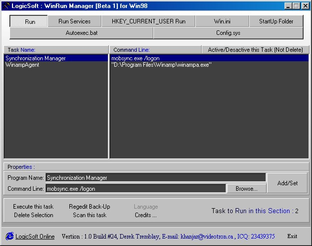



## Win Run Manager for win98

### Description

How view, edit, add, delete a task on windows startup ?? WinRun Manager tell you how!

Please vote for me is you like my code ...

--- it's a great code and will help you 

----

 
### More Info
 

             |
---                |---
**Submitted On**   |2000-10-21 13:03:38
**By**             |[Derek Tremblay \(Khenshin\)](https://github.com/Planet-Source-Code/PSCIndex/blob/master/ByAuthor/derek-tremblay-khenshin.md)
**Level**          |Advanced
**User Rating**    |4.0 (20 globes from 5 users)
**Compatibility**  |VB 5\.0, VB 6\.0
**Category**       |[Complete Applications](https://github.com/Planet-Source-Code/PSCIndex/blob/master/ByCategory/complete-applications__1-27.md)
**World**          |[Visual Basic](https://github.com/Planet-Source-Code/PSCIndex/blob/master/ByWorld/visual-basic.md)
**Archive File**   |[CODE\_UPLOAD1083610212000\.zip](https://github.com/Planet-Source-Code/derek-tremblay-khenshin-win-run-manager-for-win98__1-12200/archive/master.zip)

